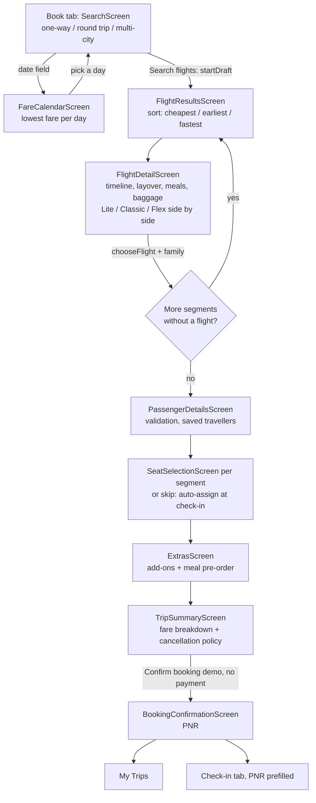
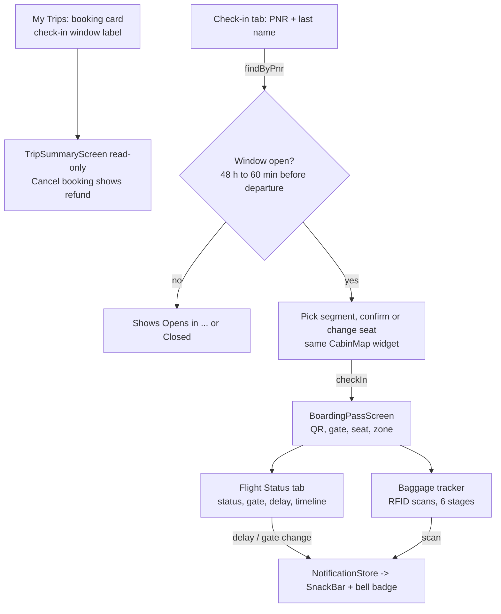
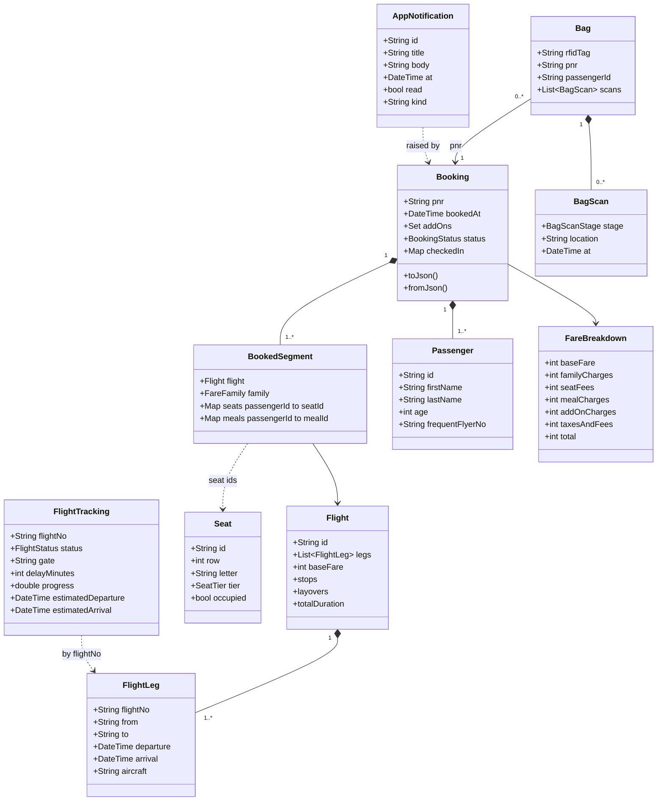

# App Flow

## 1. Journeys

### Booking journey

### Travel-day journey

## 2. Core models

Flights are serialised by value inside a saved booking, so a stored booking still loads if the schedule generator changes. Bags and tracking entries are not persisted.

## 3. State ownership (Provider)

`main()` builds `AppServices.create()` (loads stores, starts no timers), then `IndigoApp` exposes each store with `ChangeNotifierProvider.value` in a `MultiProvider`. `ShellController` is created by `IndigoApp`.

| Store | Owns | Written by | Listened to by (`context.watch`) |
|---|---|---|---|
| `BookingStore` | confirmed bookings; the in-progress `BookingDraft`; PNR generation; check-in; cancel | search, flight detail, passenger, seat, extras and summary screens; check-in | results, detail, passenger, seat, extras, summary, confirmation, My Trips, check-in, boarding pass, flight status, baggage |
| `ProfileStore` | the traveller's own profile, frequent flyer no., saved travellers | Profile screen | Profile screen (the passenger form reads it once with `read`) |
| `NotificationStore` | the notification inbox and its `incoming` stream | `BookingStore`, `FlightStatusService`, `BaggageService` | bell badge (`NotificationBell`), Notifications screen; `IndigoApp` subscribes to `incoming` to show the SnackBar |
| `FlightStatusService` | tracking entries and event timeline per flight number and date | its own timer (only when `start()` is called), demo buttons | Flight Status screen, Boarding Pass |
| `BaggageService` | in-memory bags and their scans | Baggage screen buttons, optional auto-scan timer | Baggage screen |
| `ShellController` | selected tab and a pending PNR and last name for check-in prefill | confirmation screen, `ShellController.goTo` | `HomeShell`, Check-in screen |

Stores take an injectable `clock` and `Random`, which is what makes the tests deterministic.

## 4. Persistence keys (`shared_preferences`)

| Key | Content |
|---|---|
| `indigo_bookings_v1` | JSON list of bookings. The sample booking K7Q2ZP is written on first launch only (when the key is absent). |
| `indigo_profile_v1` | the traveller's profile and the saved travellers |
| `indigo_notifications_v1` | JSON list of notifications (newest first, capped at 100) |

Not persisted: the booking draft, flight tracking and baggage scans.

## 5. Edge cases the code handles

- **Booking window boundaries:** multiplier steps at 30, 15, 7, 3 days; negative days count as last-minute; days are calendar days, not hours.
- **Flex free seat:** standard and middle seats cost ₹0 for Flex; xl and front seats are still charged.
- **First meal free:** Classic/Flex first meal per segment is ₹0; Lite pays.
- **Exclusive baggage:** picking 5 kg then 10 kg replaces the first; priority and lounge scale with passenger count.
- **Passenger form validation:** an empty first name, last name or age blocks Continue.
- **Seat conflicts:** occupied seats cannot be selected; two passengers cannot hold the same seat in a draft (the seat moves to the latest passenger); changing a flight clears that segment's seats and meals; removing a passenger drops their seats and meals. Seats held by other confirmed bookings on the same flight show as occupied.
- **Skipping seats:** allowed; Skip keeps seats already chosen and only leaves unassigned passengers to be auto-assigned at check-in.
- **Chronology:** for a later segment (multi-city or round trip) the flight list shows only flights departing at least 60 min after the previous chosen flight arrives, with a note; if none qualify an empty state suggests another date. The search screen keeps each later date on or after the previous one.
- **Check-in seat rule:** a seat change may not cost more than the seat already booked (`PricingEngine.seatFee`); with no booked seat only standard / standardMiddle seats are allowed, at no charge. Paid seats are locked on the check-in map. The fare never changes at check-in.
- **Incomplete draft:** `confirmDraft` throws a `StateError` if flights or passengers are missing.
- **PNR:** 6 characters from A–Z and 2–9 (no 0, 1, O, I look-alikes), regenerated until unique.
- **PNR lookup:** case-insensitive and trimmed on both PNR and last name; a wrong PNR shows an error and no check-in button.
- **Check-in window:** rejected before 48 h and from 60 min before departure (boundaries tested); rejected for cancelled bookings and unknown passengers; rejected if the chosen seat is taken; auto-assigns a free standard seat when none is chosen.
- **Cancellation:** Flex refunds fully up to exactly 2 h before departure and 0 after; Lite/Classic refunds never go negative and are 0 after departure; cancelling is blocked once any passenger has checked in (reason shown in the UI); a cancelled booking refunds 0 and cannot be cancelled twice.
- **Mixed-family bookings:** refund uses the per-segment fee rule, with Flex segments at ₹0 fee.
- **Corrupt saved data:** unreadable JSON leaves the bookings or notifications list empty instead of crashing.
- **Sample booking seeding:** the demo booking is added once, not on every launch. If a later launch finds it untouched (not cancelled, no check-in, same seat) and already departed, it is re-seeded relative to the current time so demo check-in works.
- **Tracking:** entries are keyed by `flightNo@yyyy-MM-dd` (the same flight on two dates is tracked separately). Every newly confirmed booking is tracked automatically (`BookingStore.onBookingConfirmed`, wired in `AppServices`). Bags are routed on the first flight's from → to.
- **Untracked flight hooks:** simulating a delay or gate change on an untracked flight does nothing (returns false).
- **Baggage:** scanning stops at "collected" (returns null); bags are created only when a check-in bag is included (Classic/Flex or an extra-baggage add-on), idempotently.
- **Timers:** none run in tests; `stop()` / `dispose()` cancel them.
- **Responsive layout:** tested at 360 px phone width without overflow; `NavigationRail` from 900 px; fare families side by side on wide screens and a horizontal scroll on phones.
